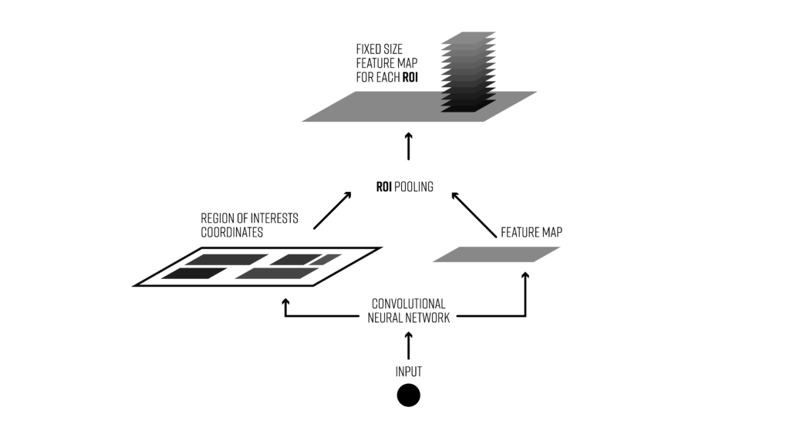

# ROI pooling是什么？！

在目标检测的任务中，一般来说会有两个阶段

1. **Region proposal**: 这个阶段输入是一张图片(或者是图片的feature map)， 然后输出是所有有可能是目标的地方。
2. **Final classification**: 对于上一个阶段提出的所有有可能的地方，输出它是哪一类（或者是背景）。

但是**Region proposal**提出的区域有大有小，各种长宽比都可能存在，而**classifier**对于输入图像大小是固定的。**ROI (Region of Interest) pooling** 做的事情就是将不同大小，不同长宽比的region统一固定大小。

### 例子

假设convolutional neural network 最后输出的feature map 大小为 $8 \times 8$, 而我们ROI Pooling 的输出大小是 $2 \times 2$. 输入的feature map 假设长这样：

假设Region proposal中其中一个位置是这样$[0,3,7,8]$,

通常情况下我们会有多个这样的框，但是目前我们就拿一个来做例子。

接下来我们会把这个框分成$(2 \times 2)$ 四个部分，即和我们的输出大小一致

每个框内，输出最大值（和max-pooling 很像)，即为ROI pooling 最终输出值

