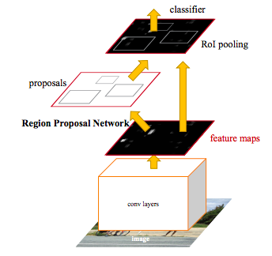
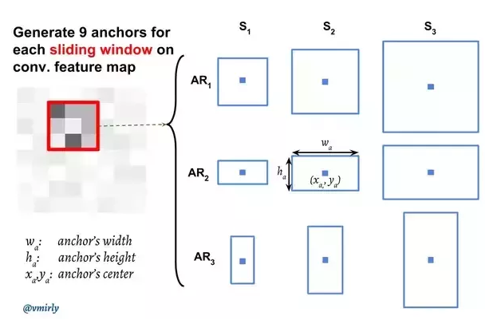
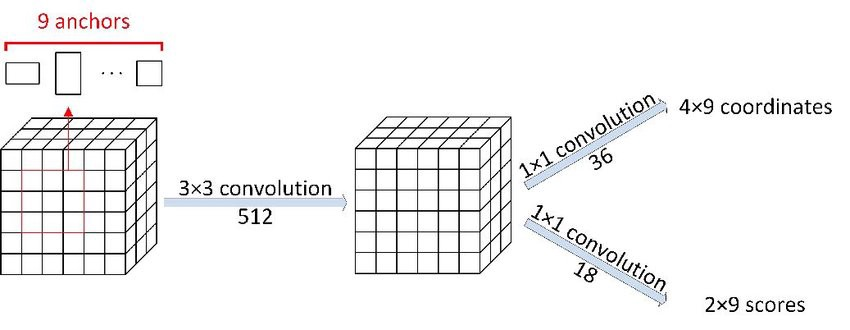

# RPN (Region Proposal Network) 是什么

RPN在物体识别的过程中，属于特征提取(ResNet, VGG)之后， ROI Pooling 之前的网络。RPN负责根据特征图生成一定的候选框，经过ROI Pooling后送个classifier 进行分类。RPN在训练过程中需要学习两个参数：

* 当前框内有目标的概率是多少
* 目标的具体位置（即[x1,y1,x2,y2]具体是多少）

那么它是如何生成候选框的呢

### 基本原理

特征图上的每个像素点都会被RPN视作一个Anchor point。 每个anchor point 上都会生成N 个预设框。 这些预设框有两个参: scales and aspect ratios. Scales 决定预设框的大小，而 aspect ratios决定预设框的长宽比。例如下图的9 个anchors的设定值就是scales:[8, 16, 32], ratios [0.5, 1, 2]。

一张图上的anchors数量为 $w \times h \times Nratio \times Nscals$

这些生成的预设框注定是和我们目标有一定距离的， RPN的一个任务之一就是学习偏离值的大小。一般来说偏离值会有四个：

* 预设中心的位置和实际中心点位置的差: 
  * $g_{cx}=(c_x -\hat c_x)/\hat w$, $g_{cy} = (c_y - \hat c_y)/ \hat h$
* 预设框的长和宽与实际长宽的比例 
  * $g_w = log(w/\hat w)$, $g_h = log(h/\hat h)$

与此同时我们还会有另外一个网络学习每个anchor中存在目标（即非背景）的概率，这两个网络大致张这样：

这里稍微解释一下，假设特征图的大小为$w \times h \times c$ ，经过RPN网络后会生成两个值，第一个值的大小为$w \times h \times 4 \times 9$ 即channel为36的结构， 每个点上的所有数值即代表这个点上所有anchor 的偏离值。 例如左上角（0，0）上的36个值，分别代表着该点上9个预设框，每个预设框4个偏离值。

第二个值的大小为$w \times h \times 2 \times 9$，即每个anchor内存在目标的概率，每个anchor用one-hot vector来表示概率。

### Loss

RPN学习的数值有两个， 因此RPN会有两个loss。但是考虑到绝大部分的anchor内不会有物体出现，为了不让正负样本相差太多，RPN的loss只考虑下面两种类型的anchor:

* 与ground-truth有最大IoU的anchors，计算BCEloss
* 与gound-truth的IoU超过70%，计算预测框和实际框直接的差值（L1loss）

#### Reference

Region Proposal Network (RPN) — Backbone of Faster R-CNN:

https://medium.com/egen/region-proposal-network-rpn-backbone-of-faster-r-cnn-4a744a38d7f9

Region Proposal Network — A detailed view:

https://towardsdatascience.com/region-proposal-network-a-detailed-view-1305c7875853

a-PyTorch-Tutorial-to-Object-Detection:

https://github.com/sgrvinod/a-PyTorch-Tutorial-to-Object-Detection

