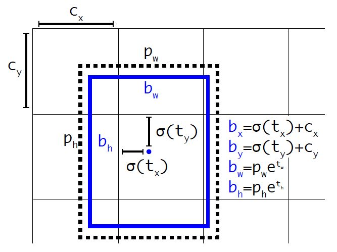
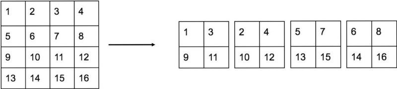

# YOLO v2 改进

* 不再使用dropout，而是在每个卷积层后面加Batch Normalization
* 提高分辨率( 224 -> 448)
* 使用Anchor boxes，每个anchor box 拥有单独一套分类概率值。准确率降低但回召率上升。为了约束边框值，YOLOv2的预设中心点为每个cell的左上角，使用sigmoid函数保证中心点始终在cell中。四个offset为$t_x,t_y,t_w,t_h$，计算公式为:

$$
b_x = \sigma(t_x)+c_x\\
b_y = \sigma(t_y)+c_y\\
b_w = p_we^{tw}\\
b_h = p_he^{th}
$$

* 检测时使用$416\times416$，使得最终的特征图大小为$13 \times 13$, 保证只有一个中心点位置
* 通过聚类(Dimension Clusters)获得预设框数值
* 使用Darknet-19作为特征提取，类似VGG16，采用$3\times3$卷积核和$2\times 2$的max pooling。 没有提高正确率但计算量下降
* 采用精细特征图（Fine-Grained Features）预测小物体，YOLOv2利用的是最后一个max-pooling前的feature map，大小为$26 \times 26 \times512$，采用passthrough将其转换为$13 \times 13 \times 2048$ ，然后与最后一层feature map $13 \times 13 \times 1024$链接，生成$13 \times 13 \times 3072$，在此特征图上做预测。

* 使用Multi-Scale training 采用不同大小的图片（长宽为32的整倍数）进行训练，大概每隔10个epoches随机选择一种输入图片大小

### reference

目标检测|YOLOv2原理与实现(附YOLOv3)

https://zhuanlan.zhihu.com/p/35325884

