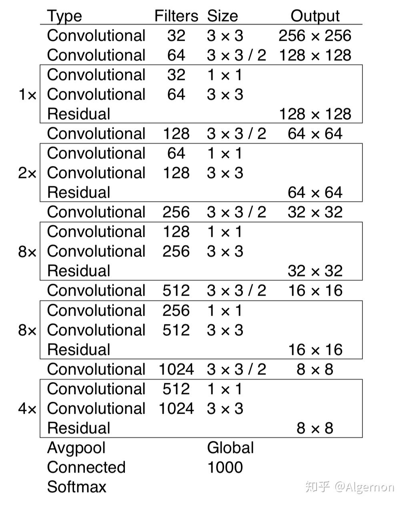
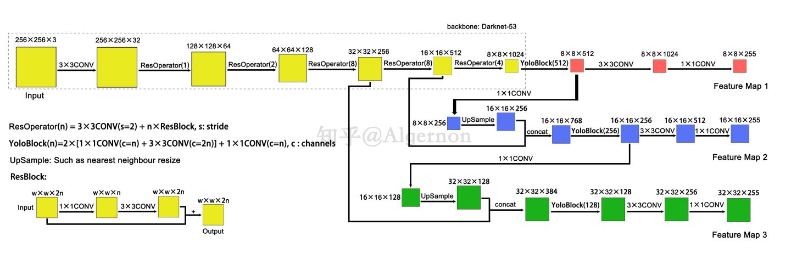

# YOLO v3 改进

*  backbone 由YOLO v2的Darknet-19进化至Darknet-53,加深了网络层数，并采用了差残网络。

* 只有卷积层，通过调节卷积步长控制输出特征图尺寸
* YOLO v3 继续保留v2的每个anchor box独享一个类别置信度。特征图输出尺寸为$N \times N \times (3 \times(4+1+80))$，$N\times N$为输出特征图分辨率，每个cell三个anchor boxes，外加四个偏移量，1个预测框置信度，80个类别预测值。

* Yolov3总共输出3个特征图，第一个特征图下采样32倍，第二个特征图下采样16倍，第三个下采样8倍。输入图像经过Darknet-53（无全连接层），再经过Yoloblock生成的特征图被当作两用，第一用为经过3*3卷积层、1*1卷积之后生成特征图一，第二用为经过1*1卷积层加上采样层，与Darnet-53网络的中间层输出结果进行拼接，产生特征图二。同样的循环之后产生特征图三。
* concat操作与加和操作的区别：加和操作来源于ResNet思想，将输入的特征图，与输出特征图对应维度进行相加，即$y=f(x)+x$；而concat操作源于DenseNet网络的设计思路，将特征图按照通道维度直接进行拼接，例如$8\times8\times16$的特征图与$8\times8\times16$的特征图拼接后生成$8\times8\times32$的特征图。

### reference

论文解读】Yolo三部曲解读——Yolov3

https://zhuanlan.zhihu.com/p/76802514