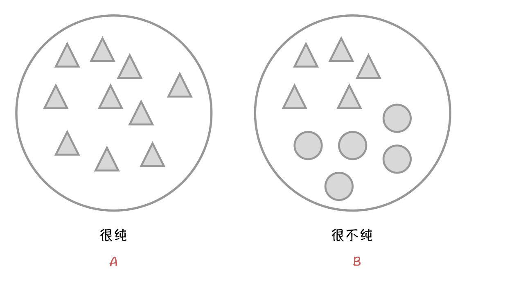

今天我想来讲的是：**Binary Cross Entropy**
在一开始做图片分类的时候，只要是二分类问题，都会无脑用Binay Cross Entropy，那个时候完全没有想过Entropy是什么，Cross Entropy又是什么 (ノへ￣、)

## Entropy
Entropy 中文是熵(这个中文并没有什么用， 简单来说是用来衡量一个类的纯净度，纯净度越高，熵越小。如果对**决策树**的原理有印象的话，这个东西可以用来计算Information Gain，从而决定用哪个属性做分割，大概吧，扯远了。

看下面这个图，左边的圈圈里面全部都是三角形，所以是非常的纯，而右边的圈圈里面一半是三角形一半是圆形，所以是非常的不纯。

当然就这样说纯，很纯，非常的不纯是不够的，我们需要定性的来表示到底有多存，于是就有这个公式:
$$
entropy = - d_{triangle} log(p_{triangle}) - d_{circle} log(p_{circle}) 
$$
其中 $d_{triangle}$ 表示在这个类中三角形的分布，$p_{triangle}$表示三角形出现的概率，图片A中，三角形的的分布为$100\%$，概率也是100%，简单来说就是一样的。

让我们来稍微计算一下两个类的熵：
$$
EntropyA = - 1 \times log(1)- 0 \times log(1) = 0
$$

$$
EntropyB = -0.5 \times log(0.5)-0.5 \times log(0.5)=1
$$

0 表示非常的纯，1表示非常的不纯。

### 那么问题来了

我们在做图片分类的时候，其实并不知道每个类的分布$d$是什么样的（其实可以但是会很麻烦，但是我们可以找个东西替代一下

#### 举个例子

假如我们要做个二分类的问题，判断一张图片是猫（1）还是狗（0），假设batch size 为 6

| 名称   | ,1,0,1,1,0]                    |
| ------ | ------------------------------ |
| Target | [0, 1, 0, 1, 1, 1]             |
| Output | [0.1, 0.9, 0.1, 0.1, 0.2, 0.8] |

*其中Output中的值代表这张图片属于猫的概率为多大，若真值为1（这确实是只猫，那么Output的值越大越准确。*

我们会用**subset**（也就是这6个值中）的分布 $q$ 来代替我们不知道的 $d$，即：
$$
d_{positive} \approx q_{positive} = \frac{4}{6} =0.67
$$

$$
d_{negative} \approx q_{negative} \frac{2}{6}= 0.33
$$

既然不一样了就应该有个新的名字，这就是**Cross Entropy**，定义为：
$$
entropy = -\sum{q_ilog(p_i)}
$$
或者再准确点应该是这样：
$$
entropy = -\sum_{i}^{postive}q_{positive} log(p_{pi})+\sum_{i}^{negative}q_{negative} log(p_{ni})
$$
让我们先来看看这里面每个东西是什么，能不能搞出来

首先 $p_{pi}$ 是指这个图片属于positive(猫)的概率，即我们模型的输出，也就说上面表中 $p_{pi}=Output[i]$，Nice！

接下来是$p_{ni}$也就这个图片属于negative(狗)的概率，我们能够很简单的得出来：属于狗的概率等于不属于猫的概率，也就是$p_{ni}=1-Outout[i]=1-p_{pi}$

至于$q_{positive}$和$q_{negative}$，上面不是已经算出来了吗？！？

接下来我们就稍微改下公式，由于$q_{positive}$和$q_{negative}$都是常数所以可以拉出来
$$
entropy = -q_{positive}\sum_{i}^{postive}log(p_{pi})+q_{negative} \sum_{i}^{negative}log(p_{ni})
$$
然后稍微改一改$q_{positive}$和$q_{negative}$，用$1-p_{pi}$代替$P_{ni}$
$$
entropy = -\frac{1}{N_{positive}+N_{negative}}\sum_{i}^{postive}log(p_{pi})+ \sum_{i}^{negative}log(1-p_{pi})
$$
然后再搞的优雅一点
$$
entropy= -\frac{1}{total}\sum_{i=0}^{n}target_i\times log(p_i)+(1-target_i)\times log(1-p_i)
$$
也就是当$target_i = 1$时，我们用$log(p_i)$，当图$target_i =0$时我们用$log(1-p_i)$

## Loss函数

接下来我们再看看pytorch官网的[BCEloss](https://pytorch.org/docs/stable/nn.html#torch.nn.BCELoss)
$$
l_n = -w_n[y_n \times log(x_n) + (1-y_n) \times log(1-x_n)]
$$
其中$w_n$可以先不管，$y_n$即$target_i$, $x_n$即$p_i$

当函数的**reduction = "sum"**时，返回:
$$
sum(l_n)
$$
当函数的**reduction = "mean"**时，返回:
$$
\frac{1}{N}sum(ln)
$$
这个时候就和上节求的Entropy一样了。

ヽ(✿ﾟ▽ﾟ)ノ

