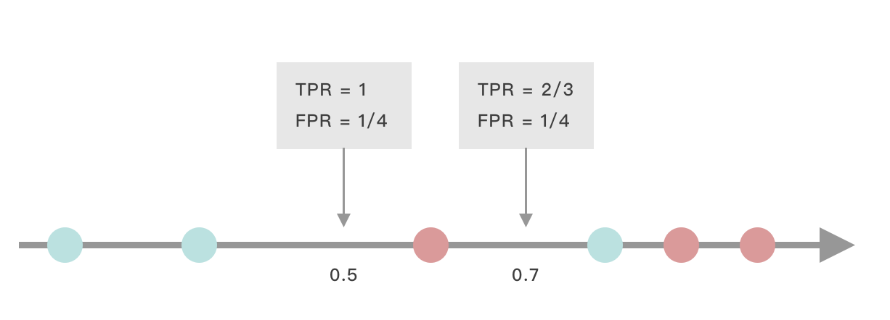
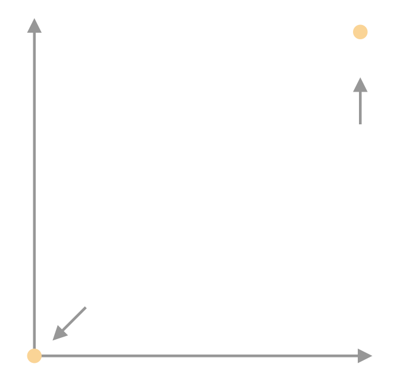
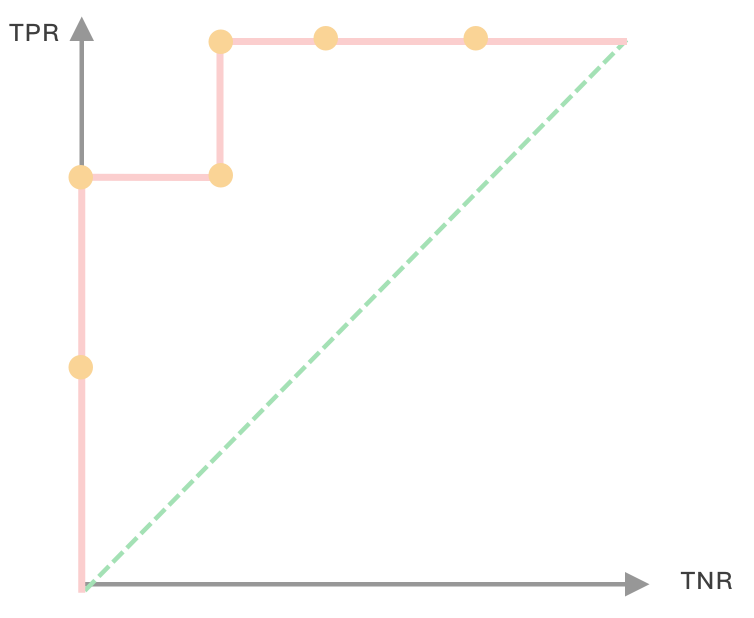
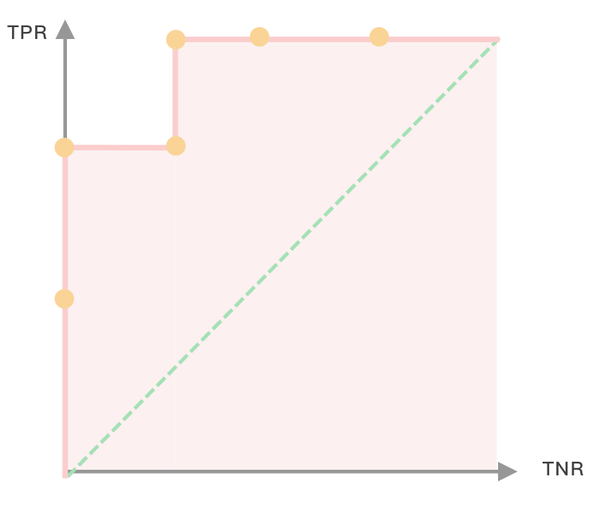
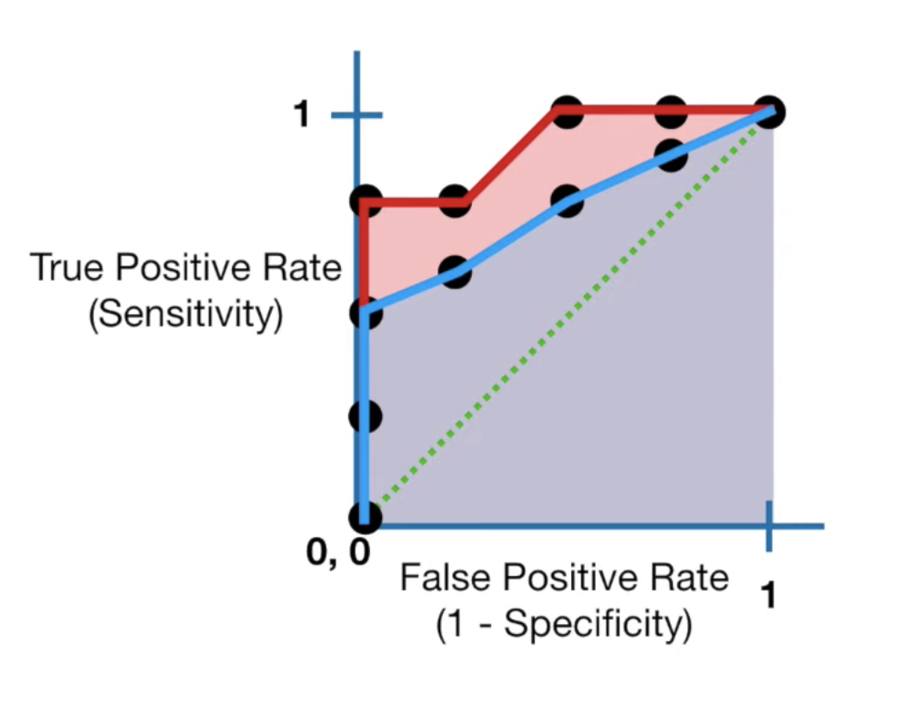

# ROC and AUC

假设现在我们有一个模型，这个模型会读入一个乐器的照片，输出这个乐器为钢琴的概率。

| 分数 | 是否是钢琴 |
| ---- | ---------- |
| 0.9  | 是         |
| 0.8  | 是         |
| 0.72 | 否         |
| 0.56 | 是         |
| 0.3  | 否         |
| 0.2  | 否         |
| 0.1  | 否         |

假设我们决定为钢琴的阈值是0.7（即若模型输出大雨0.7，那么我们就认为这个照片是钢琴），这个时候的confusion maxtrix 为:

| A            | 是钢琴 | 不是钢琴 |
| ------------ | ------ | -------- |
| 预测是钢琴   | 2(TP)  | 1(FP)    |
| 预测不是钢琴 | 1(FN)  | 3(TN)    |

通过confusion matrix 我们可以计算TRP(True Positive Rate/recall/Sensitivity)
$$
TPR = \frac{TP}{TP+FN}
$$
和FPR(False positiv rate):
$$
FPR = \frac{FP}{TN + FP}
$$
当阈值为0.7时，$TPR = 2/3$，$FPR = 1/4$

我们也可以调整阈值为0.5，这个时候的confusion matrix 为

| A            | 是钢琴 | 不是钢琴 |
| ------------ | ------ | -------- |
| 预测是钢琴   | 3(TP)  | 1(FP)    |
| 预测不是钢琴 | 0(FN)  | 3(TN)    |

这时$TPR = 1$，$FPR = 1/4$，FPR保持不变但是TPR增加了。也就是说，即便是同一个模型，采用不同的阈值，模型的表现有可能完全不同

ROC实际上就是采用不同的阈值时，TPR 和FPR的值。

当阈值等于0时，也就是说模型不分青红皂白将所有图片都分为钢琴$TPR = 3/3+0 =1$，$FPR = 3/3+0 = 1$。当阈值等于1时，模型将所有的图片都归位非钢琴,$TPR = 0/0+3 =0$，$FPR = 0/0+3 = 0$

这两个点可以连成一条线，在这条线上所有的点，都意味着模型正好将一半的钢琴分对，一半的钢琴分错，也就是最坏的情况。

把刚刚计算的两个点放进去，可以看到阈值为0.5的点离绿色的线更远，所以阈值为0.5的表现比0.7的要好。

接下来我们可以计算所有阈值的情况（从 0 -1）得到下面这个图

这个就是ROC啦

## AUC

AUC全称是Area Under the Curve。Curve是指ROC曲线，那么也就是下面这个面积

简单计算一下就是$1-1/4 \times 1/3 = 11/12$，也就是AUC=11/12

AUC 越大模型就越好，换言之在下面这个图片当中，红色所代表的模型比蓝色代表的模型要好。

从上面的计算可以知道，ROC比较的是**用一个**模型不同阈值的表现情况，AUC比较的是**不同**模型的表现情况。值得注意的是，在一些负样本非常多的情景下，FPR 会被替换为precision。(不然TN可能会非常大，使得FPN一直都很小)
$$
precision = \frac{TP}{TP+NP}
$$

# AUC简便计算

但是这种先算ROC后算AUC的计算方法太麻烦了，有没有更简单的方法呢？答案是有的，基于Mann-Whitney U-test。

Mann-Whitney U-test最初是用来评价两组数据是否来自同一个分布。如果得到的值越小，那么两组数据来自同一个分布的可能性越小。

在分类问题中，我们希望当我们预测的概率越小，有更多的负样本，预测的概率越大，有更多的正样本。这样我们的模型才能给正负样本不同的分布。如果我们模型无论预测值为多少，正负样本数量都一致，那么我们模型就做得不是很好了。

基于 Mann-Whitney U-test 的AUC计算公式为:
$$
AUC = \frac{\sum I(P_P,P_N)}{N_P \times N_N}\\
I = (P_P,P_N)
\left\{  
             \begin{array}{**lr**}  
             1,P_P>P_N & \\  0.5,P_P=P_N & \\  0,P_P<P_N & \\  
             \end{array}  
\right. 
$$
其中$N_p,N_N$分别为正负样本的数量。而$I$实际计算的是每个正样本的概率大于多少个负样本的概率。用我们刚刚的例子计算一下：

那么这个方法得到的AUC：
$$
AUC = \frac{4+4+3}{3\times 4} = \frac{11}{12}
$$

### reference 

ROC and AUC, Clearly Explained!

https://www.youtube.com/watch?v=4jRBRDbJemM

AUC的计算方法

https://blog.csdn.net/qq_22238533/article/details/78666436

The ROC-AUC and the Mann-Whitney U-test

https://johaupt.github.io/roc-auc/model%20evaluation/Area_under_ROC_curve.html